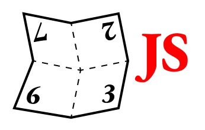

  

# makebook-js

A utility for taking a normal pdf and imposing multiple pages onto single pages for printing, folding, and binding as a booklet or book.

Based on the ['makebook' shell script](https://github.com/dgoodmaniii/makebook) by Donald P. Goodman III.

## To Do

- Reimplement logic for signatures other than quarto
- Reimplement the internal use of big points (as given by pdfinfo)
- Update the docs to reflect any changes in defaults/ settings from the original
- Reimplement conversion of other units (?)

## Documentation

An overview of how to use this tool (including helpful information on bookbinding) is provided [here](./DOCUMENTATION.md).

## System Dependencies
- pdfinfo
- pdftk
- pdflatex

## Licensing

This program is free software:  you can redistribute it and/or modify it under the terms of the GNU General Public License as published by the Free Software Foundation, either version 3 of the License, or (at your option) any later version.

This program is distributed in the hope that it will be useful, but WITHOUT ANY WARRANTY; without even the implied warranty of MERCHANTABILITY or FITNESS FOR A PARTICULAR PURPOSE.  See the GNU General Public License for more details.

For a full copy of the GNU General Public License, see [here](http://www.gnu.org/licenses/).
